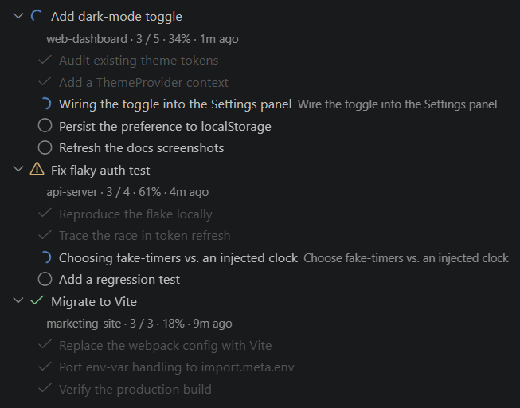
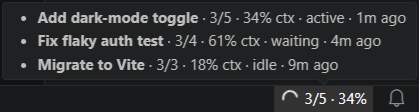

# Coding Session Todos

A VS Code sidebar that mirrors the live `TodoWrite` task list from your active
[Claude Code](https://docs.claude.com/en/docs/claude-code) sessions — so you can
watch the plan unfold without keeping the terminal in focus.

It works entirely by tailing the transcript JSONL files Claude Code writes under
`~/.claude/projects/`. Nothing is sent anywhere; there are no runtime
dependencies and no configuration required to get started.

> **Claude Code only, for now.** Despite the agent-agnostic name, the extension
> currently reads [Claude Code](https://docs.claude.com/en/docs/claude-code)
> transcripts exclusively. Support for other coding agents may come later.



## Features

- **Live todo list** — the current `TodoWrite` snapshot for each active session,
  re-rendered as the transcript changes. The in-progress item is highlighted.
- **Every window, one place** — sessions are read globally from
  `~/.claude/projects/`, so a single panel shows every Claude Code session active
  across _all_ your open VS Code windows and workspaces — not just this one —
  sorted most-recent-first, each with its own todos.
- **Session state at a glance** — a spinner while Claude is working, a warning
  when a session looks like it's waiting on you (e.g. a permission prompt), and a
  check when it's idle.
- **Context usage** — the percentage of the model's context window consumed,
  shown per session and in the status bar (matches Claude Code's `/context`).
- **Status-bar widget** — a compact `current/total · NN%` readout for the session
  running in your current workspace, with a tooltip listing every active session.



## Requirements

[Claude Code](https://docs.claude.com/en/docs/claude-code) installed and used at
least once, so transcripts exist under `~/.claude/projects/`. The extension reads
those files read-only; it does not run or control Claude Code.

## Installation

From the VS Code Marketplace: search for **Coding Session Todos** in the Extensions view,
or install from the command line:

```bash
code --install-extension abslabs.coding-session-todos
```

Or build and install a local `.vsix`:

```bash
npm install
npm run package          # produces coding-session-todos-<version>.vsix
code --install-extension coding-session-todos-<version>.vsix
```

## Settings

| Setting                                   | Default | Description                                                                                                                        |
| ----------------------------------------- | ------- | ---------------------------------------------------------------------------------------------------------------------------------- |
| `codingSessionTodos.activeSessionMinutes` | `300`   | How recently a session must have been touched (in minutes) to appear in the panel. Default 300 (5 hours). Min 5, max 1440 (1 day). |

## How it works

- Lists every transcript under `~/.claude/projects/` whose modification time is
  within the active window, and reads only the trailing ~1 MB of each (transcripts
  routinely exceed 20 MB).
- Scans that tail backward for the latest `TodoWrite` tool call and renders
  `input.todos`, plus the session's title, inferred state, and context usage.
- The workspace folder is matched against the `cwd` recorded inside each
  transcript, not guessed from the folder name (Claude Code's encoding has shifted
  across versions).
- Re-reads on file changes (debounced) and re-scans when sessions start, stop, or
  age out.

## Privacy

Everything stays local. The extension only reads transcript files already on your
machine and makes no network requests.

## Development

```bash
npm install      # also wires up the pre-commit hook (typecheck + test)
npm run build    # compile to out/
npm test         # vitest
```

Press `F5` in VS Code to launch an Extension Development Host with the extension
loaded. See [AGENTS.md](AGENTS.md) for architecture notes.

## License

[MIT](LICENSE)
